## Implementation
The idea was to build ExcavatorAPI that has bidirectional communication with ExcavatorClient. The server has a list of actions you can perform and the client has a list of possible events that it can receive from the server.

## ExcavatorAPI
ExcavatorAPI is a collection of 5 services.

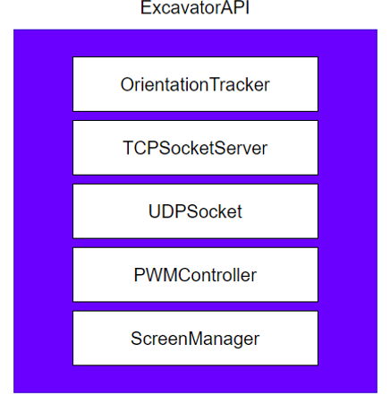

* TCPSocketServer service receives all messages from the ExcavatorClient.
* OrientationTracker service tracks the excavators orientation.
* UDPSocket service is used for transfering data during operations such as remote driving.
* PWMController service is used to control the PWM signal chips output voltages.
* ScreenManager service controls the views of the [screen](https://www.adafruit.com/product/326).

### UDPSocket Service
UDPSocket service has two threads in it. One is continuously receiving data from a peer. Heartbeat threads purpose is to detect stale/corrupted connections. This is achieved by polling the latest received data packet timestamp to a cleanup time. Clean up time is specified by the peer when they say how often they will be sending data multiplied by 15. This means it is only used when the UDPSocket service is expecting to receive something from a peer.

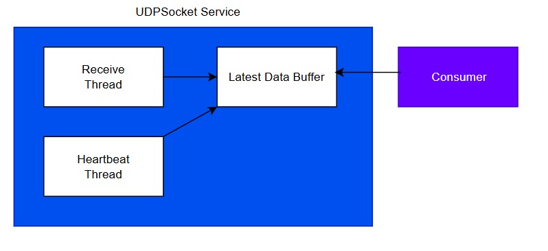

Before any threads are spawned though server and client have to perform a successful handshake where they specify how many data elements they will output and receive and their size. For example in mirroring operation servers (excavator) output count is 3 and receive 0 while client (motion platforms computer) receive count is 3 and output count 0. These output and recieve counts have to match for a succesful handshake. Once they do this information is used in the receive thread to extract the data and validate it with CRC checksum. Corrupted data is just siletly dropped and logged in the services status.

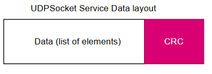

### OrientationTracker Service
OrientationTracker service just reads [sensors](https://www.adafruit.com/product/4503) data and passes it to [Fusion](https://github.com/xioTechnologies/Fusion) object that tracks the orientation. On each loop iteration latest orientation is placed on a buffer that any consumer can fetch. Current implementation only reads accelerometer and gyroscope because the motion platform only has 2 DOF. Magnetometer is not needed to track pitch and roll.

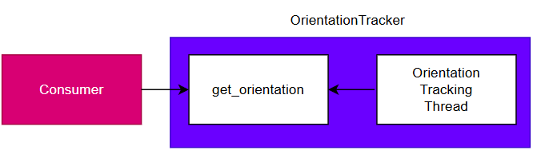

### ScreenManager Service
ScreenManager service handles all the [screens](https://www.adafruit.com/product/326) functions. Currently it is very basic it has a start and stop methods to start and disable the screen. It has a [default view](https://github.com/AI-MaSi/Excavator/tree/main/oled) that shows the excavators ip. This was originally a separate linux service but it was rolled under this ExcavatorAPI to make it the hub of all excavators management.

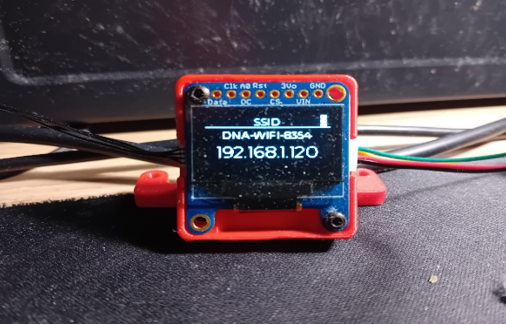

ScreenManager service has also a render queue where you can push custom messages although currently this is not really used for anything useful, but it could display the excavators battery level in the future. The logic on what view to display is very simple, if the queue is empty default view is shown.

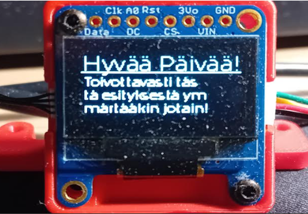

### PWMController Service
[PWMController service](https://github.com/AI-MaSi/Excavator/blob/main/modules/PCA9685_controller.py) manages all the logic with controlling the PWM signal chip. It essentially has 3 functions that we use: update_channels_by_name, reset_channels and cleanup.

## ExcavatorAPI actions:

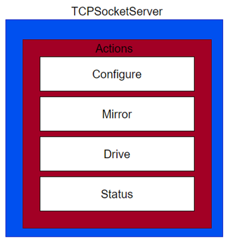

* Configure actions let you edit the configuration files of the services or to fetch them.
* Mirror action lets you start the mirroring operation.
* Drive action lets you start the driving operation.
* Status actions let you ask the current status of a given service.

### Operations
Operations are a collection of services needed to perform a given operation. There are currently only two operations drive or mirror operation and the combination of both of them at the same time. Only one operation is allowed to be performed at the same time.

#### Driving Operation
Driving operation uses PWMController and UDPSocket service on the excavator side while ExcavatorClient uses controller and UDPSocket service.

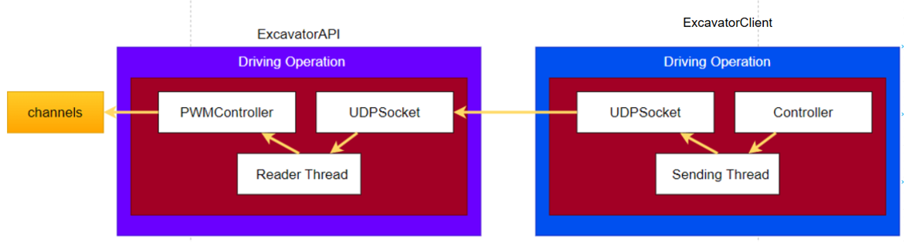

#### Mirroring Operation
Mirroring operation uses OrientationTracker and UDPSocket service on the excavator side while ExcavatorClient uses only the UDPSocket service. Target application in this case would be moving the motion platform.

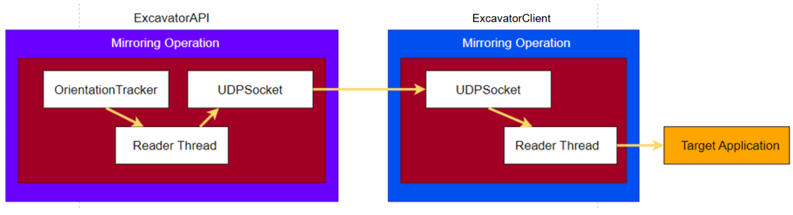

Driving and mirroring operation as a combination works excatly the same way except UDPSocket service is receiving and sending data at the same time.

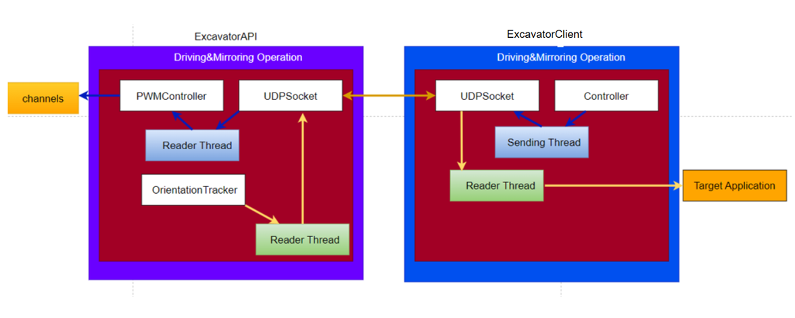

## ExcavatorClient
### ExcavatorClient Events:

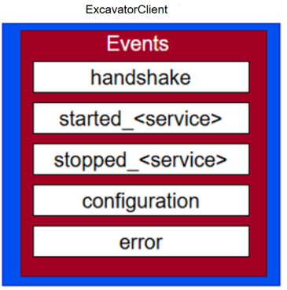

* Handshake is used when coordinating UDPSocket services transfer rules.
* Every service sends out service end and start notifications.
* For any error it is communicated with error event

All messages from the ExcavatorAPI have context field attached to it to tell you more about which function is this message from.

### ExcavatorClient API
ExcavatorClients purpose is to hide away all the cooridnation with the ExcavatorAPI with easy to use API.

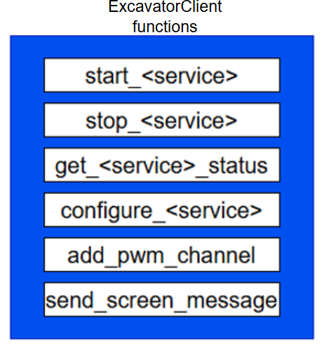

## ExcavatorAPI Tester Agent
There is a agent file that tries to use all the actions ExcavatorAPI has to offer and report if they were succesful or not.

