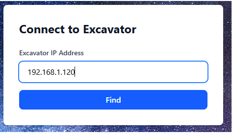
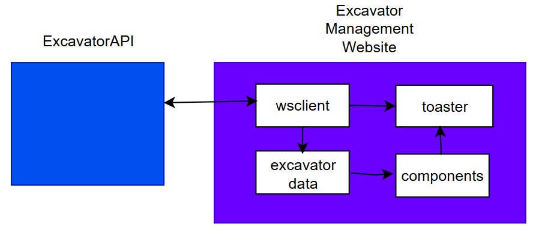
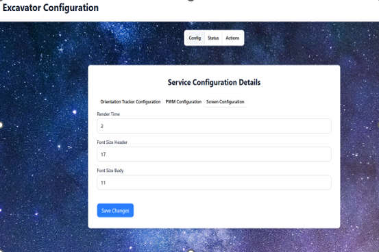
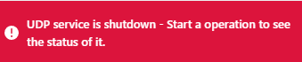
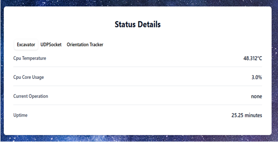
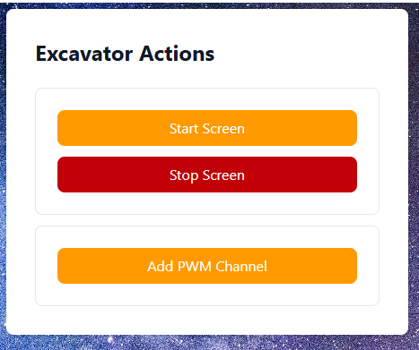

# Excavator Management Website

## Connecting to the excavatorAPI
First you connect to the excavator through the ConnectCard component.

## Data Flow
After successfully connecting to the excavator, wsclient is set up at the App component with the useRef hook. This wsclient object can now send commands to the server and receive events from the server. All messages are routed to the toaster component so users can see what is happening.

The first commands to the server will be to fetch all configuration info and set them to the App component's state. These states are given to any component that needs them. There is no separate state management system like Redux, because there is a very small number of components.

There are 3 selection groups below the header through which you can select which component will render in the center of the website. By default, it is the configuration component. You can update all the excavators configuration files through these configuration tabs. All data validation happens server-side.

When you open the status selection group, it will start a routine to fetch the specific status you are currently on with the setInterval function. These routines are only started after clicking on them, because most of the time the specific statuses are not available, such as UDP status. This is because they are only active when there is an operation underway, like remote driving the excavator with a controller.

 
 
All status routines are canceled once the user clicks away from the status selection group.

The Actions component will let you perform actions for the excavator through button clicks. Excavator operation management is not here, because it already has a dedicated implementation and this website is meant primarily only for excavator configuration purposes.

## Technical Details
* React
* Vite
* Tailwind CSS
