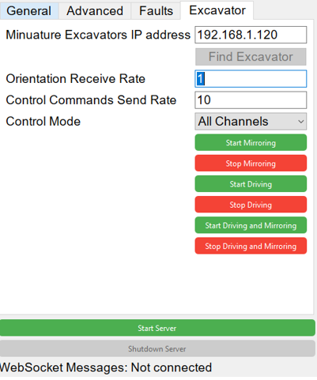
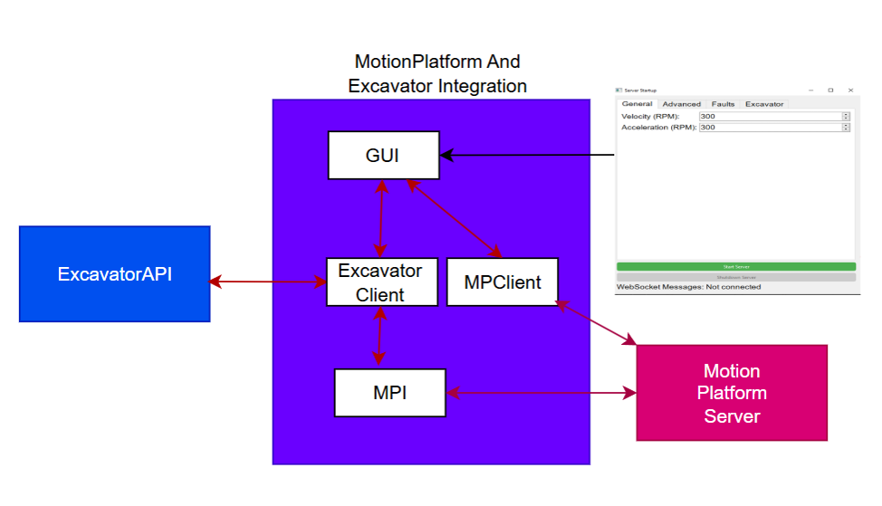

# ExcavatorAPI and Motion Platform Integration
This integrates the [API](https://github.com/Emil-Frisk/Motion-Platform-) that rotates the motion platform and ExcavatorAPI that manages all functions for the miniature excavator.

The GUI through which you open the motion platform server has been extended by adding an excavator tab. There you connect to the excavator and you can specify operation parameters and start the operations with the press of a button.

The integration simply adds the ExcavatorClient service into the mix and it uses the MPI service to rotate the platform.

